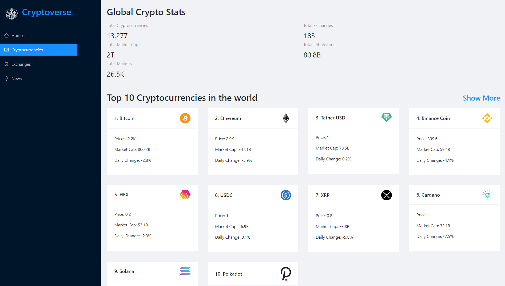

# Cryptoverse

Responsive cryptocurreny React App created with CoinRanking and Bing News Search APi. Jump in and get some knowledge about any existing cryptocurrency!

#### To run locally:
* clone repository to your computer
* **npm install** to install necessary dependencies
* create an account on <a href="https://rapidapi.com">RapidAPI</a> to get your own api_key
* create **.env.local** file in root directory and paste: **REACT_APP_OPENWEATHER_API_KEY=`your_api_key`**
* npm start

### OR

### Check it out here:

